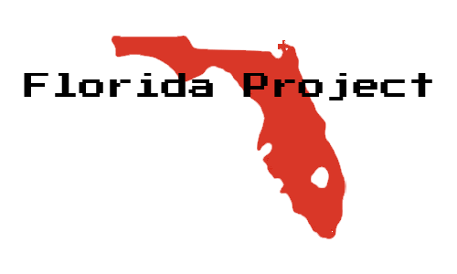

## How to Play
The Florida Project is a survival crafting game where the goal is to survive as many days as possible. The game operates on a day/night cycle. During the day, the player is free to move around the map safely. At night, enemies swarm and try to eat the player. 
The player fights back using their trusty hammer and bow. The hammer is a close ranged attack that can hit multiple enemies. The bow shoots fast moving projectiles that kill enemies from a distance.

As enemies die, they periodically drop resources. The three main resources are scrap, wood, and water. These resources can be used to craft arrows and stamina potions. Arrows are the ammo use by the bow, while stamina potions are used to remove the “Burn Out” effect players experience after depleting their stamina bar. Arrows and stamina potions can be used to get the player out of a bind when cornered by enemies.

See how many days you can survive in the Florida Project!

Gameplay Clip: [link](https://www.youtube.com/watch?v=Dx_jHjRQZmw)

## Controls
W,A,S,D - Movement

Left Click or J - Attack

Q - Change Weapons

R – Use Stamina Potion

SPACE BAR - Sprint

Hold E - Pick Up Item

TAB - Open Crafting Menu

ESC - Open Pause Menu

## Disclaimer
The Florida Project is an open-source project under the MIT license. This project is not meant as a commercial product, but as an educational learning exercise. The 2D assets were made in Photoshop. The sound assets were made in Audacity. The font assets were taken from the Google fonts.

Click the link [here](https://www.lukaspowers.com/post/the-florida-project) to learn more about The Florida Project.